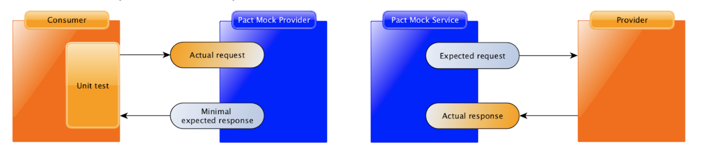
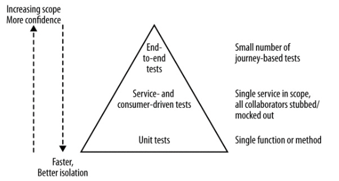

# CDC Pact
- **Pact** is a consumer-driven contract testing framework. 
Born out of a microservices boom, Pact was created to solve the problem of integration testing large, distributed systems.
(Old definition)
- Rescue for integration test cost.  
- Implement any programming language you want. [For example](https://docs.pact.io/implementation_guides/cli)
- No dedicated test environments (it works on dev machine)
- A contract between a consumer and provider is called a **pact**. Each pact is a
  collection of **interactions**. (expected request, minimal expected response)
  
- Remember that pact is for testing the contract used for communication, and not for
  testing particular UI behaviour or business logic.
-         
(Mike Cohn’s Test Pyramid. Cohn, Mike, Succeeding with Agile: Software Development Using Scrum)
     >**Unit tests** are typically test a single function or method call.     
     **Service tests** are designed to bypass the user interface and test services directly.     
     **End-to-end tests** are tests run against your entire system       

# Project Architecture

# References
[Pact Docs](https://docs.pact.io/)  
[Pact Go](https://github.com/pact-foundation/pact-go)    
[Turkish Microservice Architecture Book](https://github.com/suadev/turkish-microservice-architecture-book)    
[Pact Broker Docker](https://github.com/pact-foundation/pact-broker-docker)     
[Building Microservices](https://samnewman.io/books/)   
[Contract testing and how Pact works](https://www.youtube.com/watch?v=IetyhDr48RI)      
[Test Double](https://www.martinfowler.com/bliki/TestDouble.html)       
[Difference between gobuild and build directive](https://stackoverflow.com/questions/68360688/whats-the-difference-between-gobuild-and-build-directives)