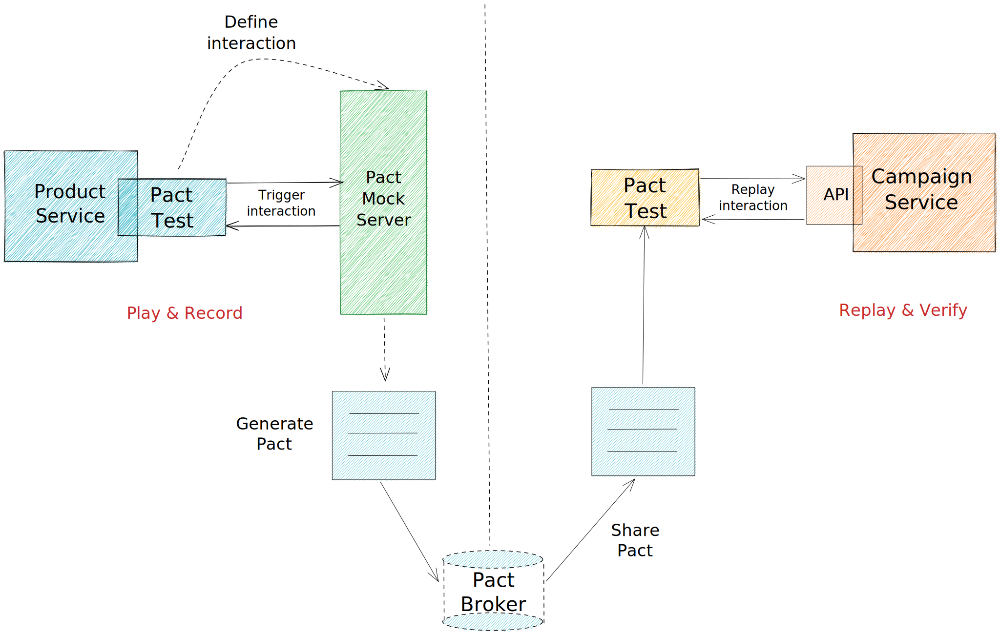
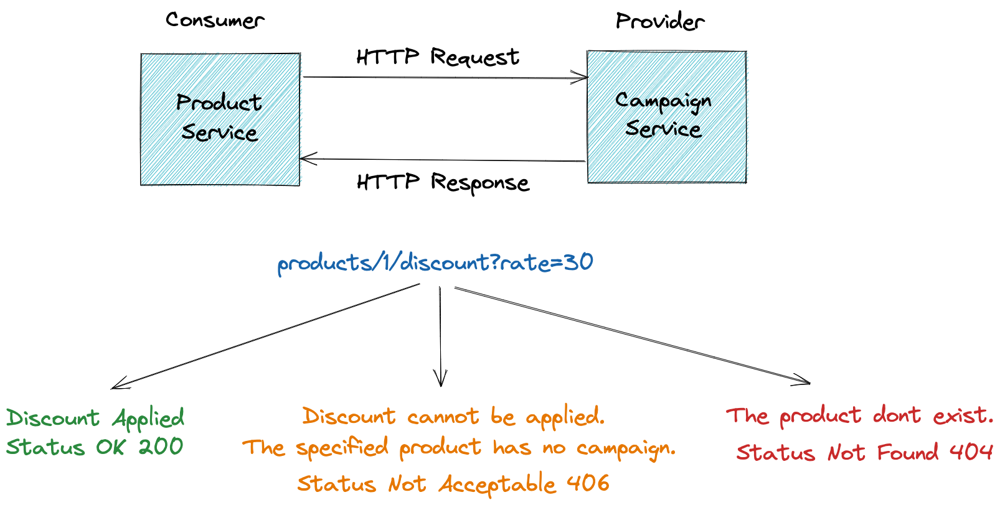

# CDC Pact 

- **Pact** is a consumer-driven contract testing framework. Born out of a microservices boom, Pact was created to solve
  the problem of integration testing large, distributed systems.
  (Old definition)
- [How Pact works slide from pactflow.io](https://pactflow.io/how-pact-works/#slide-1)
- ✅ Rescue for integration test cost.
- ✅ Gives fast feedback
- ✅ Implement any programming language you want. [For example](https://docs.pact.io/implementation_guides/cli)
- ✅ No dedicated test environments (it works on dev machine)
  
# ℹ️ Terminology 

> Interaction: A request and response pair. A pact consists of a collection of _interactions_.

> Pact file: A file containing the JSON serialised interactions (requests and responses) that were defined in the 
consumer tests. This is the Contract.

> Pact verification: To verify a Pact contract, the requests contained in a Pact file are replayed against the provider 
code, and the responses returned are checked to ensure they match those expected in the Pact file.

> Pact Specification
A provider state name is specified when writing the consumer specs, then, when the pact verification is set up in the provider 
the same name will be used to identify the set up code block that should be run before the request is executed.

# ℹ️ Pact Broker
The Pact Broker is an open source tool that requires you to deploy, administer and host yourself.
It enables you to share your pacts and verification results between projects

# Pact Generation and Verification Flow 🚀



# Project Architecture 🚀



## Matching on types

`dsl.Like(content)` tells Pact that value is not important, just focus type match.

## Matching on arrays

`dsl.EachLike(content, min)` tells Pact that the value should be array type, consisting of elements like those passed
in. `min` must be >= 1.

```
"fabrics": dsl.EachLike(dsl.MapMatcher{
    "title":    dsl.Like("Pamuk"),
    "count":    dsl.Integer()
}, 1),
```

## Matching by regular expression

`dsl.Term(example, matcher)` tells Pact that the value should match using a given regular expression, using example in
mock responses.

`"type": Term("admin", "admin|user|guest")` => "type": "admin"

## Match common formats

| method          | description                                                                                     |
|-----------------|-------------------------------------------------------------------------------------------------|
| `Identifier()`  | Match an ID (e.g. 42)                                                                           |
| `Integer()`     | Match all numbers that are integers (both ints and longs)                                       |
| `Decimal()`     | Match all real numbers (floating point and decimal)                                             |
| `HexValue()`    | Match all hexadecimal encoded strings                                                           |
| `Date()`        | Match string containing basic ISO8601 dates (e.g. 2016-01-01)                                   |
| `Timestamp()`   | Match a string containing an RFC3339 formatted timestapm (e.g. Mon, 31 Oct 2016 15:21:41 -0400) |
| `Time()`        | Match string containing times in ISO date format (e.g. T22:44:30.652Z)                          |
| `IPv4Address()` | Match string containing IP4 formatted address                                                   |
| `IPv6Address()` | Match string containing IP6 formatted address                                                   |
| `UUID()`        | Match strings containing UUIDs                                                                  |

# 🤘 References 💪

[Pact Docs](https://docs.pact.io/)  
[Pact Go](https://github.com/pact-foundation/pact-go)    
[Turkish Microservice Architecture Book](https://github.com/suadev/turkish-microservice-architecture-book)    
[Pact Broker Docker](https://github.com/pact-foundation/pact-broker-docker)     
[Building Microservices](https://samnewman.io/books/)   
[Contract testing and how Pact works](https://www.youtube.com/watch?v=IetyhDr48RI)      
[Test Double](https://www.martinfowler.com/bliki/TestDouble.html)       
[Difference between gobuild and build directive](https://stackoverflow.com/questions/68360688/whats-the-difference-between-gobuild-and-build-directives)